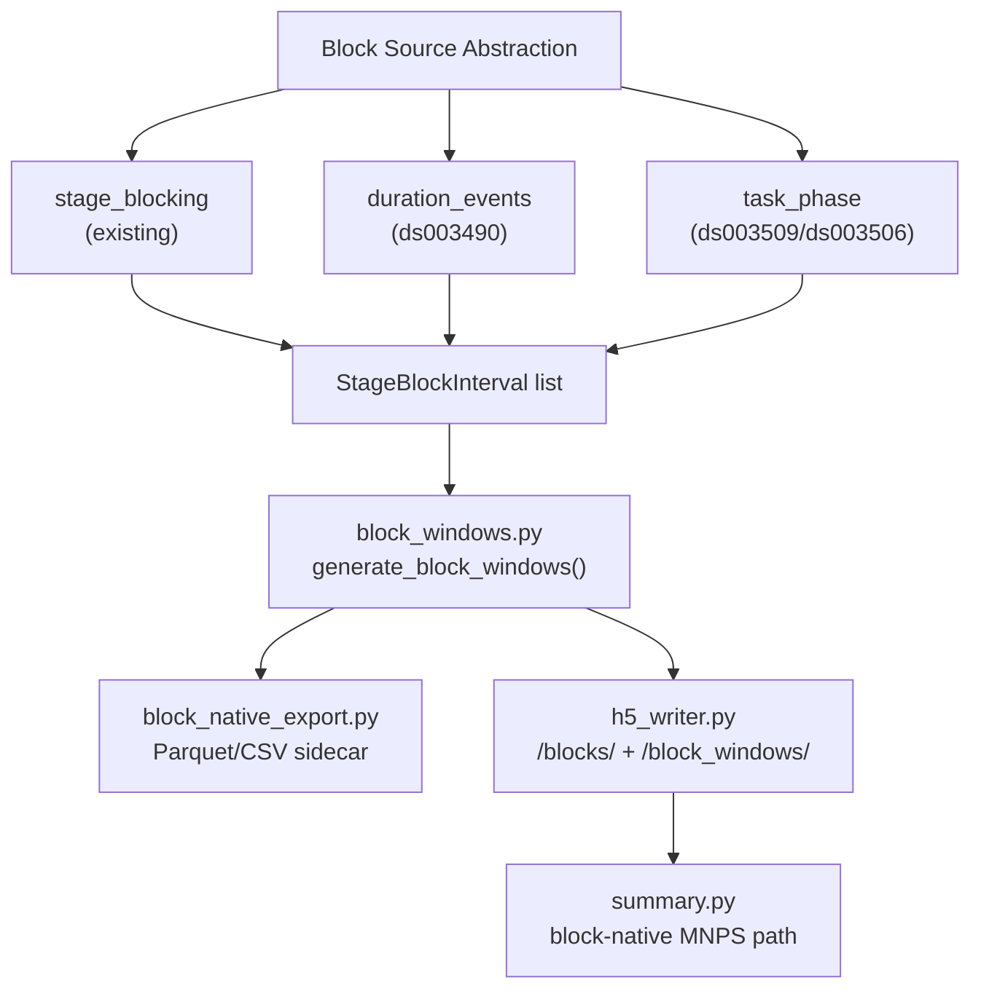

# Block-Native Window Milestones Plan

## Syfte

Skapa en milestones-fil `project/block-native_window/milestones.md` som bryter ned den arkitekturella planen i `implementation_plan.md` i konkreta, testbara delsteg med dataset-specifika valideringsmål.

## Dataset-matris

De fyra testdataseten representerar tre distinkta block-typer:

- **ds006036** — fotisk stimulering (PHOTO 3–30 Hz), `stage_blocking` redan konfigurerat, primary consumer
- **ds003490** — eyes-open/closed viloblock, duration-event-baserade macroblocks
- **ds003509** — Simon conflict, task-fas-block (training vs test faser)
- **ds003506** — RL choose/match, task-fas-block (choose vs match faser)

## Milestones som ska dokumenteras

### M1 — Kärninfrastruktur: block_windows + block_native_config

Nya filer:
- [`mndm/src/mndm/pipeline/block_windows.py`](mndm/src/mndm/pipeline/block_windows.py)
  - `BlockWindowSpec` (profile config: sliding, tail, post-offset, partitioned)
  - `BlockWindowRow` (en rad med `block_id`, `window_id_within_block`, `window_start_sec`, `window_end_sec`, `relative_time_in_block_sec`, `distance_to_block_end_sec`, `relative_pos_0_1`)
  - `generate_block_windows(blocks, spec)` → `List[BlockWindowRow]`
- [`mndm/src/mndm/pipeline/block_native_config.py`](mndm/src/mndm/pipeline/block_native_config.py)
  - `analysis_mode` toggle
  - `BlockNativeDatasetConfig`, `BlockWindowProfileConfig`
- [`mndm/tests/test_block_windows.py`](mndm/tests/test_block_windows.py)

### M2 — Block-Source Abstraktion

Generalisera block-inference bortom `stage_blocking`:
- **source kind `stage_blocking`**: återanvänd befintlig `infer_stage_block_intervals()`
- **source kind `duration_events`**: inferera block från händelser med explicit duration (ds003490 EO/EC)
- **source kind `task_phase`**: gruppa prefix-matchade triggerfamiljer till task-fas-block (ds003509 `training_*`/`test_*`, ds003506 `choose_*`/`match_*`)

Ingen ny fil behövs — utöka `block_native_config.py` med `BlockSourceConfig` och en dispatcher-funktion.

### M3 — Sidecar-Only Validering (ds006036)

- Ny fil: [`mndm/src/mndm/pipeline/block_native_export.py`](mndm/src/mndm/pipeline/block_native_export.py)
- Exportera block-native sidecar Parquet/CSV parallellt med existerande `event_locked` körning
- Jämför `in_block_tail_ms` från `event_locked` mot tail-windows från block-native
- YAML-sektion `block_native:` i `config_ingest_ds006036.yaml`

Framgångskriterium: ds006036 producerar block-native sidecar med early/mid/tail/post bins utan att ändra existerande H5-output.

### M4 — Dataset-adaptrar för task-baserade dataset

Config-overrides i respektive YAML:

- `ds003490`: `source.kind: duration_events` med EO/EC block-labels
- `ds003509`: `source.kind: task_phase` med `phase_prefixes: {training: "training_", test: "test_"}`
- `ds003506`: `source.kind: task_phase` med `phase_prefixes: {choose: "choose_", match: "match_"}`

### M5 — H5 Additivt Kontrakt

Filer att modifiera:
- [`mndm/src/mndm/schema.py`](mndm/src/mndm/schema.py): `block_table_columns`, `block_window_table_columns`, `has_block_native_windows` flag
- [`core/src/core/io/h5_writer.py`](core/src/core/io/h5_writer.py): `/blocks/*` och `/block_windows/*` grupper
- [`mndm/src/mndm/pipeline/run_manifest.py`](mndm/src/mndm/pipeline/run_manifest.py): capability flag

Minimalt H5-schema:
- `/blocks/block_id`, `/blocks/stage_code`, `/blocks/start_sec`, `/blocks/end_sec`, `/blocks/duration_sec`
- `/block_windows/block_id`, `/block_windows/window_start_sec`, `/block_windows/relative_time_in_block_sec`, `/block_windows/distance_to_block_end_sec`

### M6 — Summarize / MNPS Integration

Filer att modifiera:
- [`mndm/src/mndm/pipeline/summary.py`](mndm/src/mndm/pipeline/summary.py): branch för `analysis_mode: block_native`
- [`mndm/src/mndm/features/epoch_selection.py`](mndm/src/mndm/features/epoch_selection.py): block-first window generation path

### M7 — Komparativ Validering

- Kör ds006036 med `window_membership: overlap_frac_ge: 0.75` (nuvarande) vs block-native
- Dokumentera labeled fraction, boundary leakage, Jacobian-stabilitet
- Kör ds003490, ds003509, ds003506 i block-native mode

## Bakåtkompatibilitetskrav

- `analysis_mode: global` (default) = oförändrad körning
- Inget existerande dataset påverkas av att `block_native:` läggs till som ny YAML-sektion
- H5-grupper `/blocks/` och `/block_windows/` är additive — befintliga läsare ignorerar dem

## Dokumentation att uppdatera

- [`mndm/Output_variables_guide.md`](mndm/Output_variables_guide.md)
- [`mndm/config/config_template.yaml`](mndm/config/config_template.yaml)
- [`mndm/config/eeg_config_ingest_template.yaml`](mndm/config/eeg_config_ingest_template.yaml)
