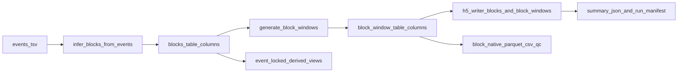

# Införandeplan: Block-Native v2 (icke-brytande)

## Beslut och scope

- Behåll canonical H5-kontrakt för `/blocks` som `start_sec/end_sec/duration_sec` och `_schema_version`.
- Leverera full roadmap i etapper, med bakåtkompatibilitet för befintliga `analysis_mode: global`-körningar.
- Prioritera först kontraktsklarhet och observerbarhet, därefter export/QC, och sist större arkitekturkonvergens.

## Målararkitektur

## Fas 1 — Kontrakt och dokumentationshärdning (P0)

- Synka dokumentation till faktisk H5-layout och attributkonvention:
  - [h:/SourceRepo2/NeuralManifoldDynamics/mndm/Output_variables_guide.md](h:/SourceRepo2/NeuralManifoldDynamics/mndm/Output_variables_guide.md)
  - [h:/SourceRepo2/NeuralManifoldDynamics/mndm/README.md](h:/SourceRepo2/NeuralManifoldDynamics/mndm/README.md)
  - [h:/SourceRepo2/NeuralManifoldDynamics/README.md](h:/SourceRepo2/NeuralManifoldDynamics/README.md)
- Dokumentera explicit befintliga `/blocks`-fält som redan skrivs men saknas i guide: `derived_from`, `end_reason`.
- Lägg till H5-kontraktstester (regression) så fältnamn/attribut inte driver igen.
  - [h:/SourceRepo2/NeuralManifoldDynamics/mndm/tests/test_writers.py](h:/SourceRepo2/NeuralManifoldDynamics/mndm/tests/test_writers.py)
  - [h:/SourceRepo2/NeuralManifoldDynamics/mndm/tests/test_block_windows.py](h:/SourceRepo2/NeuralManifoldDynamics/mndm/tests/test_block_windows.py)

## Fas 2 — Manifest- och summary-transparens (P0)

- Gör `requested_contracts`, `realized_contracts`, och `skipped_contracts_with_reason` explicita i run-manifest.
  - [h:/SourceRepo2/NeuralManifoldDynamics/mndm/src/mndm/pipeline/summary.py](h:/SourceRepo2/NeuralManifoldDynamics/mndm/src/mndm/pipeline/summary.py)
  - [h:/SourceRepo2/NeuralManifoldDynamics/mndm/src/mndm/pipeline/run_manifest.py](h:/SourceRepo2/NeuralManifoldDynamics/mndm/src/mndm/pipeline/run_manifest.py)
- Säkerställ att `block_native`-sektionen faktiskt skrivs in i per-subject `summary.json` (ordningsfix kring manifest-build).
- Utöka summary med separat block-native coverage (inte bara global `window_stage_counts`):
  - råa stage-labels
  - block-infererade intervall
  - block-native windows per stage/frekvens

## Fas 3 — Joinbarhet och proveniens (P0/P1)

- Lägg till exakt back-reference från `/block_windows` till ursprungsfönster (`source_window_index`).
  - [h:/SourceRepo2/NeuralManifoldDynamics/mndm/src/mndm/pipeline/block_windows.py](h:/SourceRepo2/NeuralManifoldDynamics/mndm/src/mndm/pipeline/block_windows.py)
  - [h:/SourceRepo2/NeuralManifoldDynamics/mndm/src/mndm/pipeline/block_native_export.py](h:/SourceRepo2/NeuralManifoldDynamics/mndm/src/mndm/pipeline/block_native_export.py)
  - [h:/SourceRepo2/NeuralManifoldDynamics/mndm/src/mndm/schema.py](h:/SourceRepo2/NeuralManifoldDynamics/mndm/src/mndm/schema.py)
- Lägg till `frequency_hz` i `/blocks` (additivt) samt rikare proveniensfält i blocktabell eller block-provenienssubgrupp.
- Utöka run-manifest field guide för nya block-/block-window-fält.

## Fas 4 — Inbyggda exporter och QC (P1)

- Koppla in befintliga exportfunktioner i pipeline (Parquet/CSV från block-native table).
  - [h:/SourceRepo2/NeuralManifoldDynamics/mndm/src/mndm/pipeline/block_native_export.py](h:/SourceRepo2/NeuralManifoldDynamics/mndm/src/mndm/pipeline/block_native_export.py)
  - [h:/SourceRepo2/NeuralManifoldDynamics/mndm/src/mndm/pipeline/summary.py](h:/SourceRepo2/NeuralManifoldDynamics/mndm/src/mndm/pipeline/summary.py)
- Lägg till `block_native_qc.json` på run/subject-nivå med:
  - block counts per stage/frekvens
  - duration/gap-fördelningar
  - truncate/end_reason-statistik
  - windows per block och filtreringsorsaker (`min_block_sec`, `min_windows_per_block`)
- Förbättra label-rensning i QC-utdata så rå/clean/normalized/mapping_status rapporteras konsekvent.

## Fas 5 — Profilbibliotek och arkitekturkonvergens (P2/P3)

- Inför named block-native profiles i config: `whole_block`, `early_block`, `mid_block`, `late_block`, `last5`, `tail8`, `post_offset_0_8`, `post_offset_8_16`.
  - [h:/SourceRepo2/NeuralManifoldDynamics/mndm/src/mndm/pipeline/block_native_config.py](h:/SourceRepo2/NeuralManifoldDynamics/mndm/src/mndm/pipeline/block_native_config.py)
  - [h:/SourceRepo2/NeuralManifoldDynamics/mndm/config/config_ingest_ds006036.yaml](h:/SourceRepo2/NeuralManifoldDynamics/mndm/config/config_ingest_ds006036.yaml)
- Starta gradvis konvergens där `event_locked` blir en härledd vy över canonical block-intervall, utan att bryta existerande `event_locked` outputs i första steget.

## Fas 6 — Validering, regressionssäkring och dokumentation

- Kör verifiering på:
  - ds006036 full cohort
  - ds003490, ds003509, ds003506 cross-dataset smoke + kontrakt
- Verifiera analytisk nytta på block-selektioner (t.ex. tail/early-jämförelser) och kontraktssida (H5, manifest, summary, sidecars).
- Dokumentera varje större etapp i ny diary entry under:
  - [h:/SourceRepo2/NeuralManifoldDynamics/project/diary/](h:/SourceRepo2/NeuralManifoldDynamics/project/diary/)

## Genomförandeordning (rekommenderad)

- Iteration A: Fas 1 + Fas 2
- Iteration B: Fas 3
- Iteration C: Fas 4
- Iteration D: Fas 5
- Iteration E: Fas 6 + slutlig kontraktsgenomgång