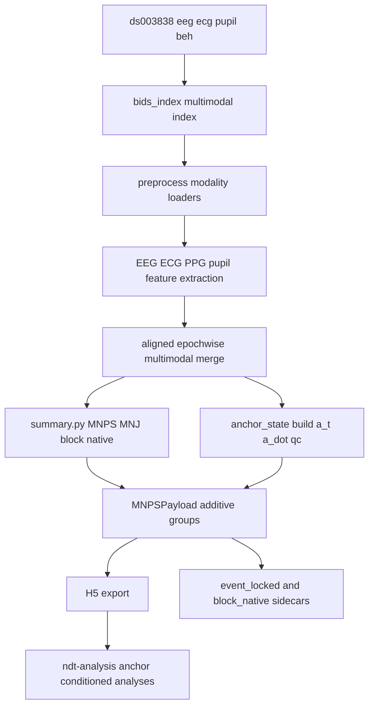

# Noetic Anchoring Dynamics Implementation Plan

## Goal
Add a first-class `AnchorState` layer to NeuralManifoldDynamics for embodied/interoceptive signals without redefining canonical MNPS. The first target is `ds003838`, using EEG plus ECG/PPG/pupillometry to test whether bodily state modulates neural geometry under task load.

Intended destination after approval: [project/ideas/Noetic Anchoring Dynamics/noetic_anchoring_implementation_plan.md](project/ideas/Noetic Anchoring Dynamics/noetic_anchoring_implementation_plan.md).

## Design Principles
- Keep neural geometry canonical: `/mnps_3d`, `/coords_9d`, `/jacobian` remain neural-only.
- Add anchor information in parallel, not inside the MNPS definition.
- Treat autonomic/pupillary anchoring as a measurement layer first, a theory claim second.
- Reuse existing additive contracts already present in the codebase: `/features_raw`, `/features_robust_z`, `/z`, optional H5 groups, sidecar exports, and manifest capabilities.
- Keep reachability-related anchor analyses downstream until anchor ingest and coupling are validated.

## Current State
- `ds003838` is configured only as an EEG overlay in [mndm/config/config_ingest_ds003838.yaml](mndm/config/config_ingest_ds003838.yaml).
- EEG and ECG have partial support today through [mndm/src/mndm/preprocess.py](mndm/src/mndm/preprocess.py), [mndm/src/mndm/features/ecg.py](mndm/src/mndm/features/ecg.py), and the fallback `embodied_arousal_proxy` in [mndm/src/mndm/parallel.py](mndm/src/mndm/parallel.py).
- PPG and pupillometry are not first-class modalities in the current pipeline.
- The schema already has room for aligned embodied channels through `/z` in [mndm/src/mndm/schema.py](mndm/src/mndm/schema.py) and documented in [mndm/src/mndm/reporting/schema_docs.md](mndm/src/mndm/reporting/schema_docs.md).
- The existing `feature_anchors` system in [mndm/src/mndm/anchors.py](mndm/src/mndm/anchors.py) is about cohort scaling, not body-state anchoring; the new anchor layer must remain separate from that concept.

## Architecture Target

## Implementation Scope

### Phase 0: Preserve the current contract and create naming boundaries
Files:
- [mndm/src/mndm/schema.py](mndm/src/mndm/schema.py)
- [core/src/core/io/h5_writer.py](core/src/core/io/h5_writer.py)
- [mndm/src/mndm/reporting/schema_docs.md](mndm/src/mndm/reporting/schema_docs.md)
- [mndm/Output_variables_guide.md](mndm/Output_variables_guide.md)

Actions:
- Reserve `anchor_state`, `anchor_quality`, and later `anchor_coupling` as new additive groups.
- Keep them explicitly distinct from `feature_anchors` and cohort anchoring.
- Document that `AnchorState` is not part of the MNPS coordinate definition.

Deliverable:
- Stable naming and H5 path contract before modality work begins.

### Phase 1: Add ds003838 multimodal indexing and alignment groundwork
Files:
- [mndm/src/mndm/bids_index.py](mndm/src/mndm/bids_index.py)
- [mndm/src/mndm/orchestrate.py](mndm/src/mndm/orchestrate.py)
- [mndm/src/mndm/preprocess.py](mndm/src/mndm/preprocess.py)
- [mndm/config/config_ingest_ds003838.yaml](mndm/config/config_ingest_ds003838.yaml)

Actions:
- Extend BIDS discovery so `ds003838` can represent separate `eeg/`, `ecg/`, `pupil/`, and `beh/` assets under a common `(subject, session, task, run)` grouping key.
- Add modality-aware handling so non-EEG files are not forced through the EEG-only assumptions.
- Decide and implement one alignment policy for the first version: epochwise alignment on the neural window grid using timestamps and nearest-window joins.
- Add ds003838-specific config for multimodal grouping and explicit enable flags.

Deliverable:
- A file index and preprocess path that can see the relevant modalities for the same recording.

### Phase 2: Add first-class feature extraction for bodily channels
Files:
- [mndm/src/mndm/features/ecg.py](mndm/src/mndm/features/ecg.py)
- [mndm/src/mndm/features/__init__.py](mndm/src/mndm/features/__init__.py)
- New modules adjacent to existing feature extractors under [mndm/src/mndm/features](mndm/src/mndm/features)
- [mndm/src/mndm/parallel.py](mndm/src/mndm/parallel.py)

Actions:
- Keep existing ECG extraction but expand it from RMSSD/SDNN-only toward a reviewer-friendly core set: heart rate, RR stability, and signal quality.
- Add a new PPG feature module with a minimal first release: pulse rate, pulse amplitude, pulse amplitude variability, and signal quality.
- Add a new pupil feature module with a minimal first release: pupil diameter mean, pupil standard deviation, dilation velocity, blink fraction/rate, and signal quality.
- Update the feature-dispatch path in `parallel.py` so these modalities can be extracted and merged into the epoch table.
- Replace the current narrow `embodied_arousal_proxy` fallback with a richer staged resolver while keeping backward compatibility.

Deliverable:
- `features.csv` and `/features_raw` surfaces that contain explicit `anchor_*` features instead of relying on a single proxy.

### Phase 3: Build `AnchorState v0.1` as a parallel aligned layer
Files:
- [mndm/src/mndm/pipeline/summary.py](mndm/src/mndm/pipeline/summary.py)
- [mndm/src/mndm/pipeline/extractors.py](mndm/src/mndm/pipeline/extractors.py)
- [mndm/src/mndm/pipeline/context.py](mndm/src/mndm/pipeline/context.py)
- [mndm/src/mndm/schema.py](mndm/src/mndm/schema.py)
- [core/src/core/io/h5_writer.py](core/src/core/io/h5_writer.py)
- [mndm/config/config_ingest_common_eeg.yaml](mndm/config/config_ingest_common_eeg.yaml)
- [mndm/config/config_ingest_ds003838.yaml](mndm/config/config_ingest_ds003838.yaml)

Actions:
- Add a small `anchor_state` builder stage after multimodal feature merge and before payload serialization.
- Compute an initial anchor vector `a_t` from robust-z standardized physiological features.
- Start with a compact, auditable set of exported dimensions:
  - `sympathetic_index`
  - `vagal_index`
  - `vascular_index`
  - `pupil_arousal_index`
  - `anchor_index`
- Export:
  - `/anchor_state/values`
  - `/anchor_state/names`
  - `/anchor_state_dot/values`
  - `/anchor_quality/values`
  - `/anchor_quality/names`
- Continue supporting `/z` as a raw embodied-alignment surface, but treat `/anchor_state` as the explicit new contract.
- Add `mnps.embodied` config wiring in ds003838 so aligned anchor channels can also be carried through existing hooks.

Deliverable:
- H5 files with a first-class AnchorState layer aligned to `/time` and separable from MNPS.

### Phase 4: Add task/load labeling for reviewer-strong ds003838 analyses
Files:
- [mndm/src/mndm/pipeline/state_labels.py](mndm/src/mndm/pipeline/state_labels.py)
- [mndm/src/mndm/pipeline/event_locked_export.py](mndm/src/mndm/pipeline/event_locked_export.py)
- [mndm/src/mndm/pipeline/block_native_export.py](mndm/src/mndm/pipeline/block_native_export.py)
- [mndm/src/mndm/pipeline/block_native_config.py](mndm/src/mndm/pipeline/block_native_config.py)
- [mndm/config/config_ingest_ds003838.yaml](mndm/config/config_ingest_ds003838.yaml)

Actions:
- Define within-run labels for `rest`, `listen`, `mem5`, `mem9`, and `mem13` using ds003838 events.
- Make sure the event-locked export includes both MNPS/MNJ variables and anchor variables in the same flat sidecar outputs.
- Prefer sidecar exports for early statistical analysis rather than prematurely promoting every result into the H5 core contract.

Deliverable:
- Task-aware tables for clean mixed-model and event-locked analyses.

### Phase 5: Add optional `anchor_coupling` diagnostics without changing canonical MNPS
Files:
- [mndm/src/mndm/jacobian.py](mndm/src/mndm/jacobian.py)
- [mndm/src/mndm/pipeline/summary.py](mndm/src/mndm/pipeline/summary.py)
- [mndm/src/mndm/pipeline/robustness_helpers.py](mndm/src/mndm/pipeline/robustness_helpers.py)
- [mndm/src/mndm/schema.py](mndm/src/mndm/schema.py)
- [core/src/core/io/h5_writer.py](core/src/core/io/h5_writer.py)

Actions:
- Implement an optional coupled local linear model over `z_t = [x_t ; a_t]`.
- Export only additive diagnostics, not a redefined neural Jacobian:
  - `/anchor_coupling/J_z`
  - `/anchor_coupling/J_xa`
  - `/anchor_coupling/J_ax`
  - `/anchor_coupling/metrics`
  - `/anchor_coupling/metric_names`
  - `/anchor_coupling/diagnostics`
- Gate these outputs on QC and support thresholds similar to current geometry sanity rules.
- Start with simple coupling summaries that are easy to explain:
  - Frobenius drive `|J_xa|_F`
  - reverse drive `|J_ax|_F`
  - directional asymmetry
  - rotational exchange

Deliverable:
- A reviewer-readable first coupling layer that asks whether body-state predicts changes in neural geometry, without overclaiming a full embodied dynamical law.

### Phase 6: Keep anchor-conditioned reachability downstream first
Files:
- Existing `mndm` export surfaces above
- Downstream analysis configs under [project](project)
- External `ndt-analysis` workflow referenced by current project diaries

Actions:
- Do not implement anchor-conditioned reachability as a core ingest responsibility in the first wave.
- Instead compute it downstream from exported neural coordinates, Jacobians, labels, and anchor sidecars.
- Promote only after stability, interpretability, and control analyses are convincing.

Deliverable:
- Lower-risk progression from measurement layer to stronger dynamical claims.

## Minimal H5 Contract Additions
Add these as optional groups, preserving backward compatibility:
- `/anchor_state/values`
- `/anchor_state/names`
- `/anchor_state_dot/values`
- `/anchor_quality/values`
- `/anchor_quality/names`
- later optional `/anchor_coupling/*`

Reuse these existing surfaces instead of replacing them:
- `/features_raw/*`
- `/features_robust_z/*`
- `/z`
- `/labels/*`
- `/events/*`
- `summary.json` and run manifest capabilities

## First Reviewer-Strong Analyses for ds003838
Start with analyses that are strong even before the full coupling stack exists.

### Analysis A: Load-aware anchor modulation of neural geometry
Question:
Does anchor state explain MNPS/MNJ variation beyond task load?

Use:
- `speed_median`
- MNJ rotation and norm
- stratified 9D redistribution
- anchor indices and anchor volatility
- mixed model with `Load + Anchor + Load x Anchor + (1|Subject)`

### Analysis B: Event-locked anchor-neural trajectories
Question:
Do EEG geometry and anchor variables co-evolve around digit-span events and differ across `listen`, `mem5`, `mem9`, `mem13`?

Use:
- event-locked exports from `event_locked_export.py`
- anchor columns joined into the same trialwise tables

### Analysis C: Null controls
Required for reviewer trust:
- time-shifted anchor within subject
- subject-shuffled anchor controls
- pupil-only vs ECG/PPG-only nested models
- signal-quality covariates and low-quality-window exclusion

### Analysis D: Optional coupling summary
Question:
Is there measurable directional body-to-brain coupling in the local chart?

Use:
- `|J_xa|_F`
- asymmetry index
- rotation exchange
- compare high vs low load and rest vs task

## Validation and Testing Plan
- Add focused unit tests for new feature modules near the existing pattern in [mndm/tests](mndm/tests).
- Add schema/H5 tests for optional anchor groups and backward compatibility.
- Add one ds003838-oriented integration smoke test that verifies multimodal merge and H5 export shape consistency.
- Reuse current geometry sanity patterns rather than inventing a second QC framework.

## Documentation Plan
Update these docs as implementation lands:
- [mndm/Output_variables_guide.md](mndm/Output_variables_guide.md)
- [mndm/src/mndm/reporting/schema_docs.md](mndm/src/mndm/reporting/schema_docs.md)
- [mndm/README.md](mndm/README.md) if user-facing config knobs are added
- add a diary entry under [project/diary](project/diary) after the substantive implementation session

## Risks and Boundaries
- ds003838 is multimodal but not stored in the single-recording shape the current EEG-first pipeline assumes; indexing and alignment are the real first bottleneck.
- Pupil data may not exist for all conditions, especially rest, so the first AnchorState must tolerate missing modalities and export quality metadata explicitly.
- The existing term `anchors` already means cohort feature normalization in this repository; naming collisions must be avoided.
- Reachability conditioned on anchor is scientifically attractive but should remain downstream until measurement reliability is shown.

## Recommended Execution Order
1. Contract and naming separation.
2. ds003838 multimodal indexing/grouping.
3. ECG/PPG/pupil feature extraction and merge.
4. `AnchorState v0.1` export into H5.
5. task/load labels and event-locked sidecars.
6. reviewer-strong mixed-model and null analyses.
7. optional `anchor_coupling`.
8. downstream anchor-conditioned reachability only after the above is stable.
